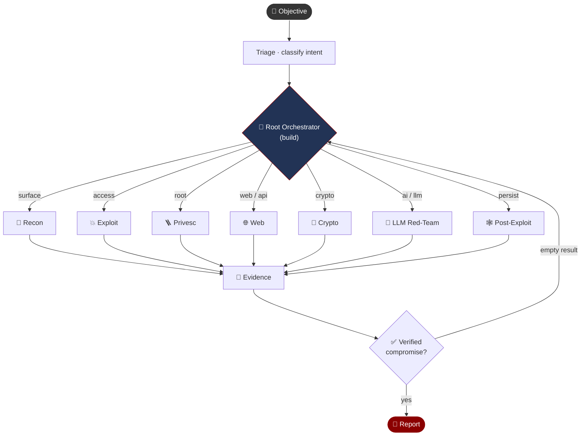

<div align="center">

# 🛡️ Boros
## ⚔️ Exploit Vector Agent

<br>

**Autonomous offensive security AI for guiding pentest processes**

[](https://github.com/uncesaii/boros)
[](https://github.com/uncesaii/boros)
[](https://github.com/uncesaii/boros/fork)
[](https://github.com/uncesaii/boros)

[](LICENSE)
[](#)
[](#)


</div>

<br>

Boros is a single binary that runs an autonomous red-team swarm in your terminal.
Give it an objective and the root orchestrator classifies it, spawns the right
specialist operators, and drives the engagement — reconnaissance, exploitation,
privilege escalation, and evidence — to a verified compromise. Every tool call,
permission prompt, and finding is reviewable in the TUI.

## How it works



The swarm **self-heals**: when a specialist comes back empty, the orchestrator
redeploys the objective with a different vector or a different operator.

## Installation

```bash
# Install script (no Node/npm required — downloads a native binary)
curl -fsSL https://raw.githubusercontent.com/uncesaii/boros/main/install | bash

# Or via npm
npm install -g @boros-ai/boros
```

## Quick start

```sh
boros                          # launch the TUI with the offensive orchestrator
boros run "@recon scan example.com"   # run a specialist directly
boros -v                       # print the installed version
```

The root agent auto-classifies your objective on the first turn and delegates
through the task tool — no ceremony required.

---

<div align="center">

Boros is built on the [OpenCode](https://github.com/anomalyco/opencode) terminal
AI shell as a base — reusing its TUI, install/auto-update pipeline, and CI/CD.

**MIT** · [Contributing](CONTRIBUTING.md) · [Security](SECURITY.md)

</div>